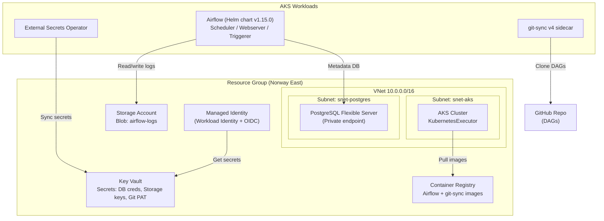

# Azure Data Platform Infrastructure

Apache Airflow on Azure Kubernetes Service (AKS) with PostgreSQL, provisioned via Terraform and deployed with Helm.

## Architecture



## Project Structure

```
terraform/          # Infrastructure as Code (Azure resources)
helm/
  env.sh.example    # Environment variables template
  deploy.sh         # Automated 7-step deployment script
  import-images.sh  # Import container images to ACR
  manifests/        # Kubernetes manifests (ExternalSecrets, PV/PVC)
  values/           # Helm chart values for Airflow
```

## Prerequisites

- Azure CLI (`az`) authenticated
- Terraform >= 1.0
- `kubectl` and `helm` installed
- A GitHub Personal Access Token for private DAG repo access

## Deployment

### 1. Provision Infrastructure

```bash
cd terraform
terraform init
terraform apply
```

This creates: VNet, AKS, PostgreSQL, Key Vault, Storage Account, Container Registry, and Managed Identity.

### 2. Deploy Airflow

```bash
cd helm
cp env.sh.example env.sh   # Fill in values from Terraform outputs
source env.sh
./import-images.sh          # Import images to ACR
./deploy.sh                 # Deploy Airflow to AKS
```

The deploy script handles: AKS credentials, namespace creation, federated identity binding, External Secrets Operator, secret synchronization, persistent volumes, and Airflow Helm release.

## Key Design Decisions

| Concern | Approach |
|---------|----------|
| Secrets | Azure Key Vault + External Secrets Operator (no secrets in code) |
| DAG sync | git-sync v4 sidecar with PAT from Key Vault |
| Logs | Azure Blob Storage via CSI driver |
| Networking | Private PostgreSQL (delegated subnet + private DNS) |
| Identity | Workload Identity (OIDC federation, no stored credentials) |
| Scaling | AKS autoscaler (2-4 nodes) + KubernetesExecutor |
